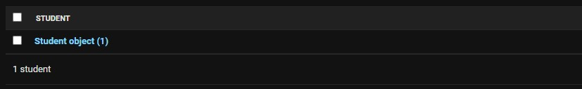
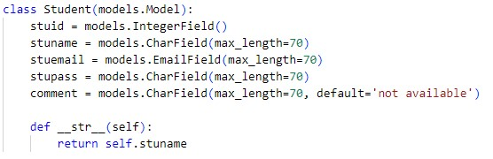
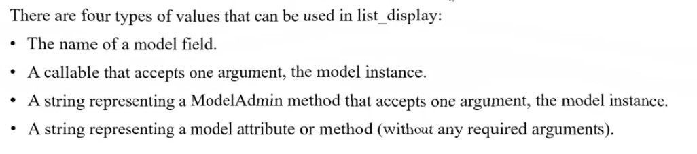
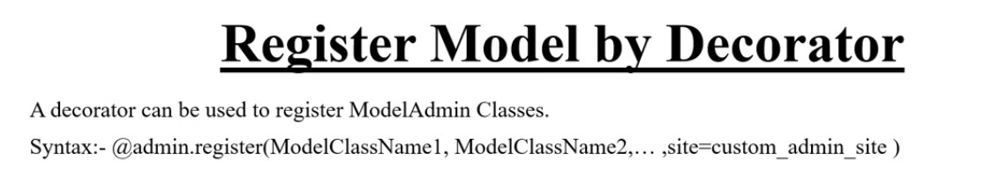

### **Basic**

```python
from django.contrib import admin
from .models import Student

admin.site.register(Student)
```
model class import kore register a dite hobe

**Data entry korar por output**




<br>

---

<br>
<br>

### **arektu valo kore dekhar jonno**

'Student Object(1)' er jaygay 'name' ba 'id' diye dekhanor jonno
sei 'model class' er vitor sobar nice ai code likte hobe

```python
    def __str__(self):
        return self.stuname
```


Note: er jonno 'migrations/migrate' korte hobe nah r **'admin.py'** er code ager tar motoi hobe

**output:**


**Note:** value jodi 'Int' thake tahole aivabe 'str' a convert kore dite hobe nahole error asbe

```python
    def __str__(self):
        return str(self.stuid)
```


<br>

---

<br>
<br>

### **Aro valo kore show korar jonno**

```python
from .models import Student

class StudentAdmin(admin.ModelAdmin):
    list_display = ( 'id', 'stuid', 'stuname', 'stuemail', 'stupass', 'comment')
admin.site.register(Student, StudentAdmin)
```
<br>
-------------- register by decorator aitau same  

```python
@admin.register(Student)
class StudentAdmin(admin.ModelAdmin):
    list_display = ( 'id', 'stuid', 'stuname', 'stuemail', 'stupass', 'comment')
```
aitate 'list_display' defoult ekta function ja admin.'ModelAdmin' theke asse  

r er moddhe ja fields er nam dibo segoloi display hobe. __ai fields golo holo model.py a define kora fields ja Student function kora hoise and import kora hoise

list_display tuple '()' and list '[]' support kore  
tuple diye likle sodho 1ta value dile error asbe, tai sei 1tar por koma ',' dile thik hoye jabe 

**Output**


**ai list_display 4type er data support kore**



**decorator ja support kore**




