## Use Defult form

ai form age thekei kora ase sob authentication set kora ase

```python
from django.contrib.auth.forms import UserCreationForm

def singup(request):
    if not request.user.is_authenticated: # jodi login kora na thake
        if request.method == 'POST':
            fm = UserCreationForm(request.POST)
            if fm.is_valid():
                fm.save()
        else:
            fm = UserCreationForm()
        return render(request, 'auth_app/sing_inup.html', {'form':fm})
    else: # jodi agei login thake
        return redirect('/profile/')
```

Output :

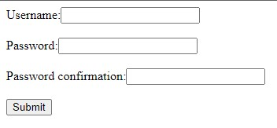

<br>
<br>

---
<br>

## Use Defult form with more fields options

aitate sob fields golo age theikei kora ase. forms a sodho user, pass silo.   
tai tar sathe abar model 'User' theke aro extra fields golou active korlam. 'UserCreationForm' form tau ai models use korse

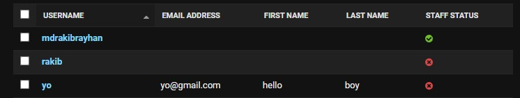

**forms.py**

```python
from django.contrib.auth.forms import UserCreationForm

from django.contrib.auth.models import User
class SingUpFrom(UserCreationForm):
    password2 = forms.CharField(label=("Password Again"), widget=forms.PasswordInput())
    class Meta:
        model = User
        fields = ['first_name', 'last_name', 'username', 'email']
        # password fields usercreationfrom theke inherit hobe
```

Notes: aitate 'UserCreationForm' inherit kora hoise tai r password fields lekha lage nai. uporer 'password' field ta lebel change korar jonno use hoise.
Baki fields golo Models User theke asse.  
sob validation golo ager motoi thik thakbe

<br>
<br>

**views.py**

```python
from .forms import SingUpFrom

def singup(request):
    if not request.user.is_authenticated:
        if request.method == 'POST':
            fm = SingUpFrom(request.POST)
            if fm.is_valid():
                fm.save()
        else:
            fm = SingUpFrom()
        return render(request, 'auth_app/sing_inup.html', {'form':fm})
    else:
        return redirect('/profile/')
forms.py
```

Output :

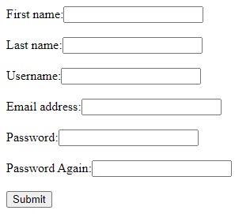


<br>
<br>

---

<br>

## Default settings setup for this

```python
INSTALLED_APPS = [
    ...
    'django.contrib.auth',  # this
    'django.contrib.contenttypes',  # this
]

MIDDLEWARE = [
    ...
    'django.contrib.sessions.middleware.SessionMiddleware', # this
    'django.contrib.auth.middleware.AuthenticationMiddleware',  # this
]
```

<br>
<br>

---

<br>

## Some method

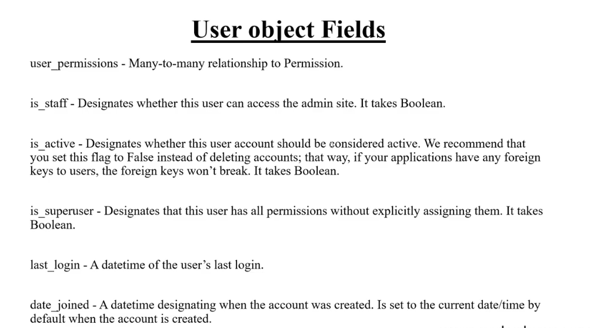
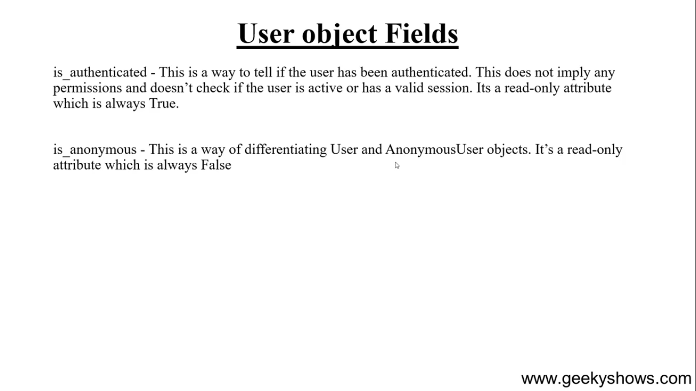
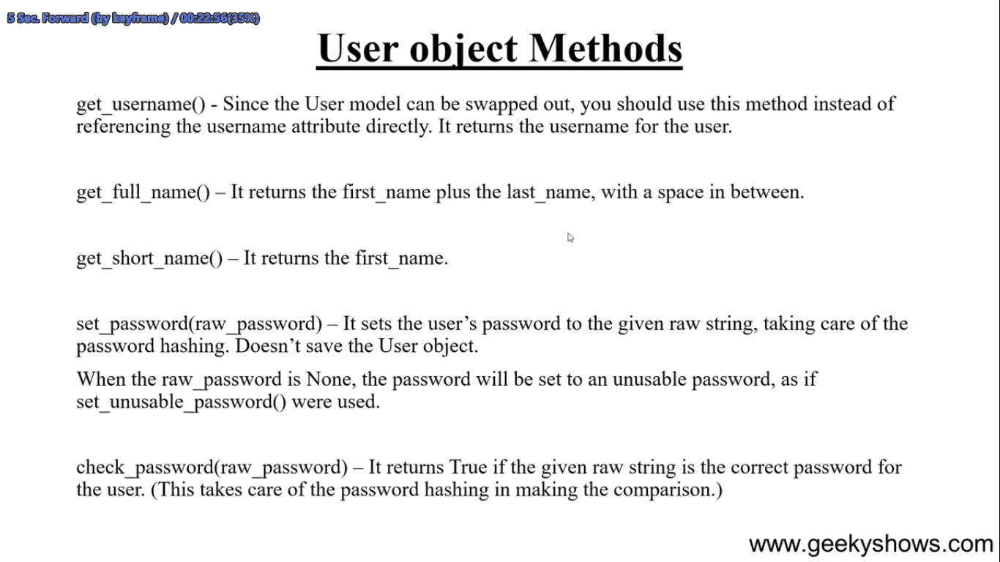
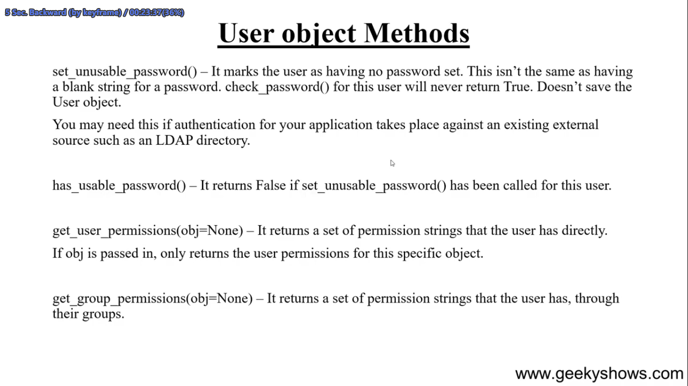
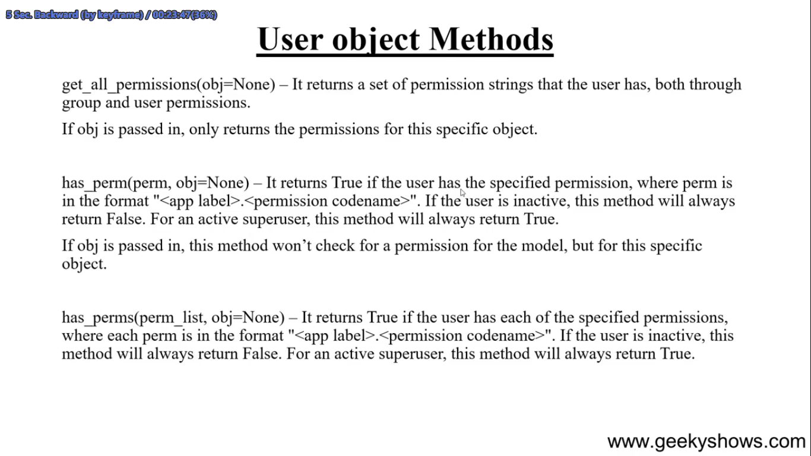
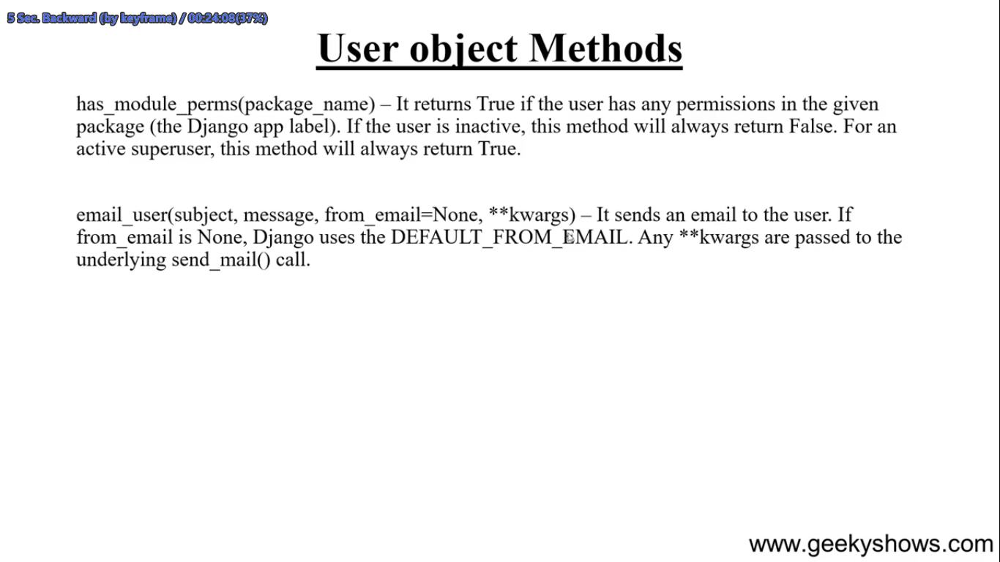
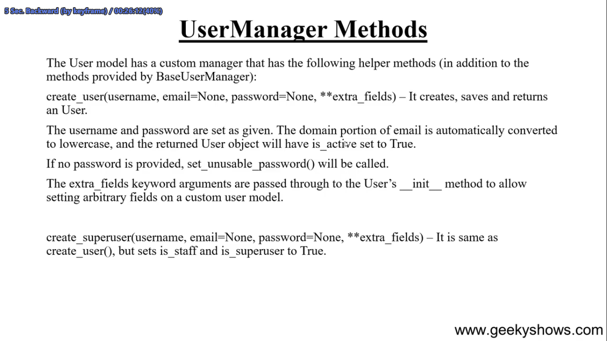
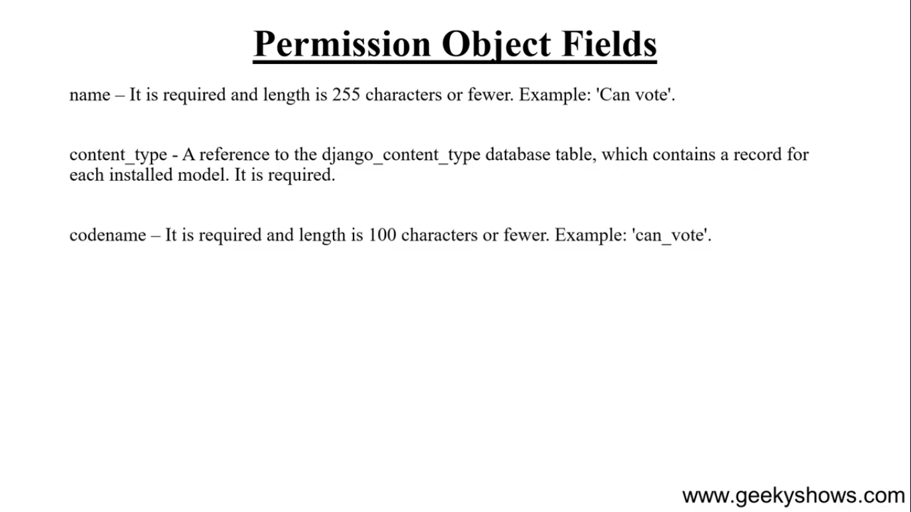

<br>
<br>
<br>

---

<br>
<br>

## **Login**

Er jonno jaja lagbe

```python
from django.contrib.auth.forms import AuthenticationForm # form er jonno

from django.contrib.auth import authenticate, login, logout # username pass match korar jonno autheticate r baki golo login logout

from django.contrib import messages # aita just success message dekhanor jonno
```

<br>
<br>

Singin/Login
--

```python
def singin(request):
    if not request.user.is_authenticated: # jodi age login kora na theke
        if request.method == 'POST':
            fm = AuthenticationForm(request=request, data=request.POST) # aitar jonno defult arokom
            if fm.is_valid():
                uname = fm.cleaned_data['username']
                pas = fm.cleaned_data['password']
                user = authenticate(username=uname, password=pas) #match hoile object r na hoilo None return kore
                if user is not None:
                    login(request, user)
                    messages.success(request, 'You Have Logged Successfully')
                    return redirect('/profile/')
        else:
            fm = AuthenticationForm()
        return render(request, 'auth_app/sing_inup.html', {'form':fm,'Singin': 'Singin'})
    else: #jodi age thekei login thake
        return redirect('/profile/')
```


<br>
<br>

logout
---

```python
def user_logout(request):
    logout(request)
    return redirect('/singin/')    
```

profile
```python
def profile(request):
    if request.user.is_authenticated: #jodi login thake
        return render(request, 'auth_app/profile.html', {'name':request.user})
    else: # na thakle vago
        return redirect('/singin/')  

```

## theuritic note:

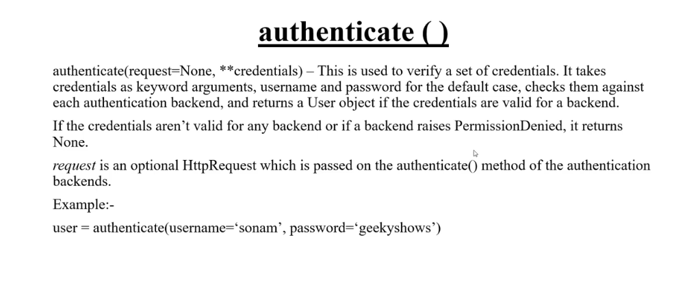
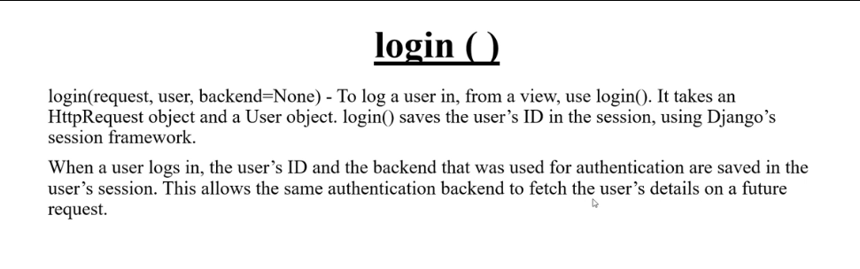