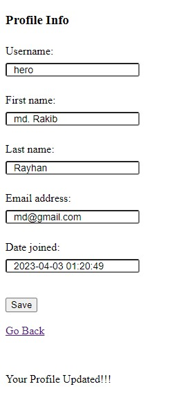
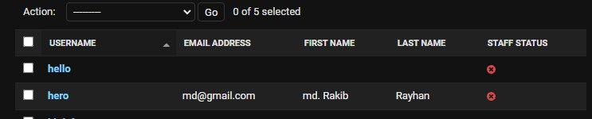
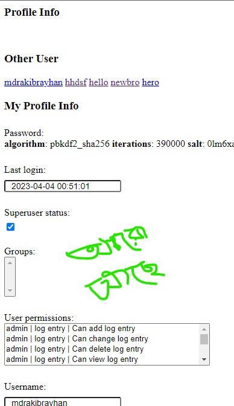
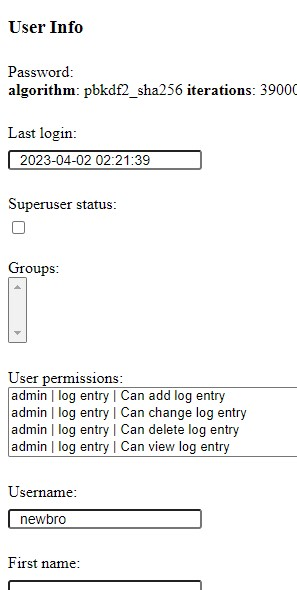

## Edit User own profile

forms.py
-
```python
from django.contrib.auth.forms import UserChangeForm
from django.contrib.auth.models import User


class EditUserProfileForm(UserChangeForm):
    password = None # aita form fields a toiri kora silo. akhane na dekhanor jonno used 'none'
    class Meta:
        model = User
        fields = ['username', 'first_name','last_name','email','date_joined']
```

profile a onnek data thake, database a jaja thake oitai aikhane pray sob dekhay. tai user ke sudho upoere golo dekhanor jonno aita use kora nahole sora sori view a kora hoito


<br>
<br>

views.py
-
```python
from .forms import EditUserProfileForm

def profile_details(request):
    if request.user.is_authenticated:
        if request.method=='POST':
            fm = EditUserProfileForm(request.POST, instance=request.user) #kon user setar bujhar jonno isinstance
            if fm.is_valid():
                fm.save()
                messages.success(request, 'Your Profile Updated!!!')
        else:
            fm = EditUserProfileForm(instance=request.user)

        return render(request, 'auth_app/profile_details.html', {'form':fm})
    
    else:
        return redirect('/singin/')
```

<br>

## Output View






<br>

---

## Admin er jonno Profile

ager tar tolonay besi details aitate thakbe

```python
from django.contrib.auth.forms import UserChangeForm
from django.contrib.auth.models import User

class EditAdminProfileForm(UserChangeForm):
    class Meta:
        model = User
        fields = '__all__'
```

<br>


agerta (userprofile) eksathe lekha hoise

request.user aita user object return kora ja amra onnek kaje use korte pari, atate user er sokol info thake like - request.user.username, request.user.email etc

```python
from .forms import EditUserProfileForm, EditAdminProfileForm
from django.contrib.auth.models import User


def profile_details(request):
    if request.user.is_authenticated:
        if request.method=='POST':
            if request.user.is_superuser == True: # jodi admin hoy
                fm = EditAdminProfileForm(request.POST, instance=request.user)
                users = User.objects.all()
            else:
                fm = EditUserProfileForm(request.POST, instance=request.user) #kon user setar bujhar jonno isinstance
                users = None # object khali khalte error ase tai aita deya hoise
            if fm.is_valid():
                fm.save()
                messages.success(request, 'Your Profile Updated!!!')
        else:
            if request.user.is_superuser == True:
                fm = EditAdminProfileForm(instance=request.user)
                users = User.objects.all()
            else:
                fm = EditUserProfileForm(instance=request.user)
                users = None

        return render(request, 'auth_app/profile_details.html', {'form':fm, 'users':users})
    
    else:
        return redirect('/singin/')
```

<br>

others users username with dynamic url to show more details
```html

        <br>
        <h3>Other User</h3>

        
        <a href="">{{user.username}}</a>
        


```

### additional imformation er pasapasi admin user er CRUD and user details jate change korte pare

```python
# just done update - try CRUD
def user_details(request, id):
    if request.user.is_authenticated:
        if request.user.is_superuser == True:
            pi = User.objects.get(pk = id)
            if request.method == 'POST':
                fm = EditAdminProfileForm(request.POST, instance=pi)
                if fm.is_valid():
                    fm.save()
                    messages.success(request, 'Profile Updated!!!')
            else:
                fm = EditAdminProfileForm(instance=pi)
            return render(request, 'auth_app/user_details.html', {'form': fm})

    else:
        return redirect('/singin/')
```
aitate just user er details/status change/update kora option ase. Muloto aitate puro CRUD oparation kora lage. Ja pore korte parben. jemon add,del user

example sorup some pic:



Other User a jokono user a clik korle tar details

