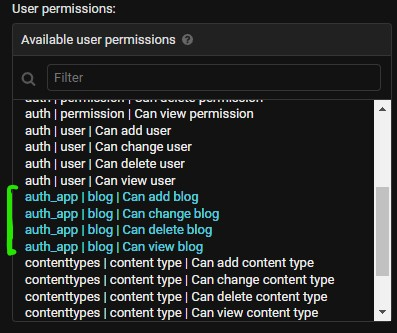
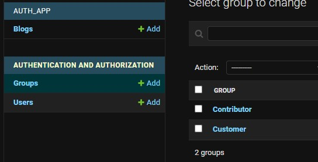
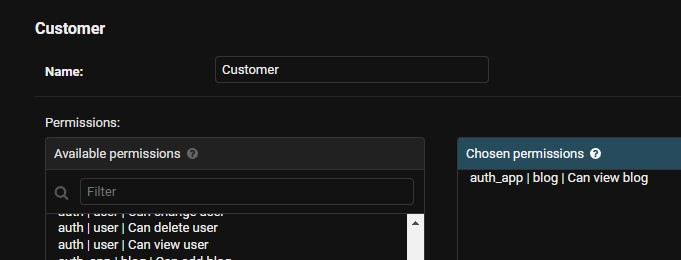
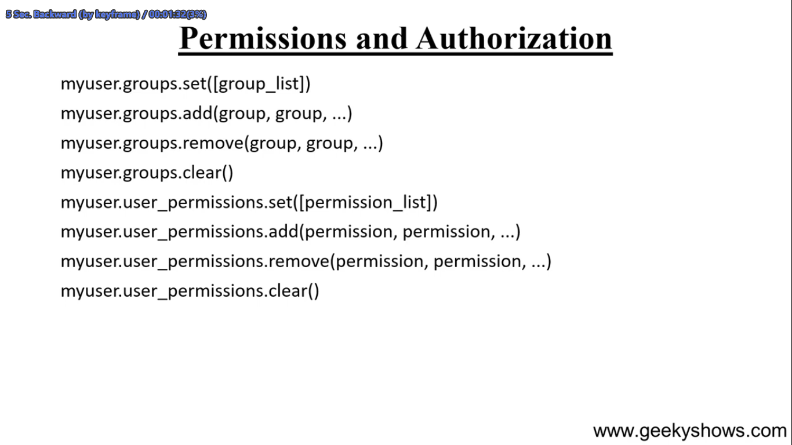
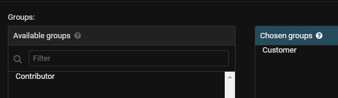
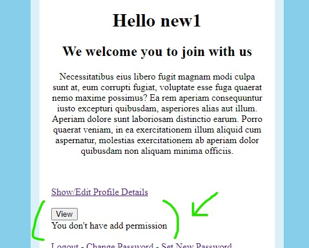

## **Useges**
subcriber/paid customer der alada vabe access deya

contribur site a creator der permission deya
etc

<br>

## **Permission Category**
Amra jokhon models.py a kono class toiri kori tokhon django te er jonno permission toiri hoy

example:-
models.py
```python
class Blog(models.Model):
    title = models.CharField(max_length=100)
    desc = models.CharField(max_length=250)
```



ukto models.py er jonno ai 4ta permission auto create hoise. ate "auth_app" holo amar app ner nam, "blog" holo amar models er nam

<br>
<br>

## **Group**

Admin theke Akadhik permission er Group create kora jay. ate pore ekta ekta perssion deya lage nah.

aitate 2ta group create kora hoise jar 1ta permission pic deya ase





## **Permission**

Permission multiple wayte deya jay -> register er somoy permission deya, Odhoba contributer, subcrib etc te Permission deya, admin theke deya

Admin korte hobe-> a user er profile a giye permission deya lage.

<br>
<br>

### **Singup with permission**
singup er full code deya hoy nai, aita deya hoise permission er code er jonno
```python
from django.contrib.auth.models import Group

def singup(request):
    if not request.user.is_authenticated:
        if request.method == 'POST':
            fm = UserCreationForm(request.POST)
            if fm.is_valid():
                user = fm.save() # aita last deya maybe better

                # permission er code
                group = Group.objects.get(name = 'Customer') # group er nam diye group selete kora hoise
                user.groups.add(group) # group add kore permission deya hoise


                return redirect('/singin/')
```

ai system a aro onnek vabe permission deya jay




Group a add hoyar por admin theke dekha jabe




<br>
<br>

### **Permission pauya user er jonno aro option**
ai html code jara jara je niddisto permission pabe, tara sodho seta dekte parbe

niyom  
perms.APPNAME.PERMISSIONTYPE_MODELNAME
```html
    
    <input type="button" value="View">
    
    <div>You don't have view permission</div>
    

    
    <input type="button" value="Add">
    
    <div>You don't have add permission</div>
    
```

amader registration kora user tike customer group add kora hoy jate sodho 'view' permission silo. to setar output

