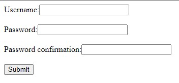
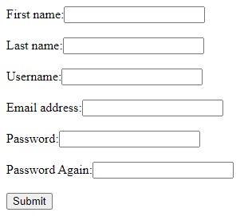
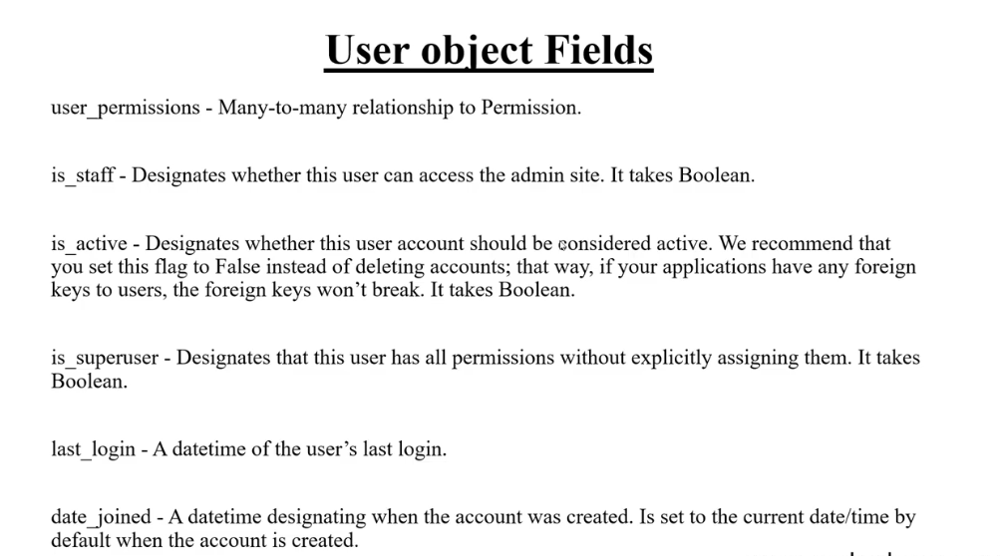
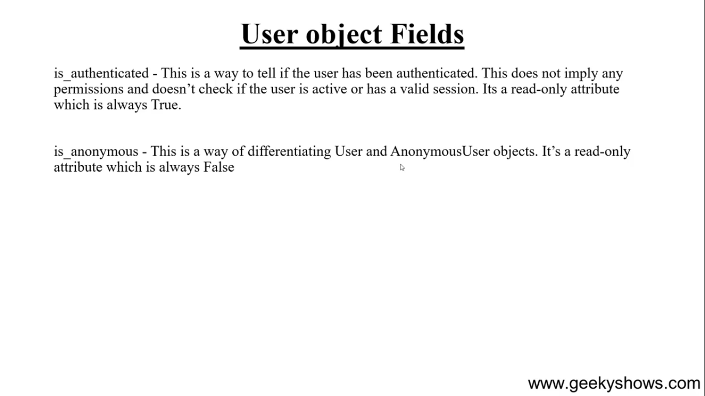
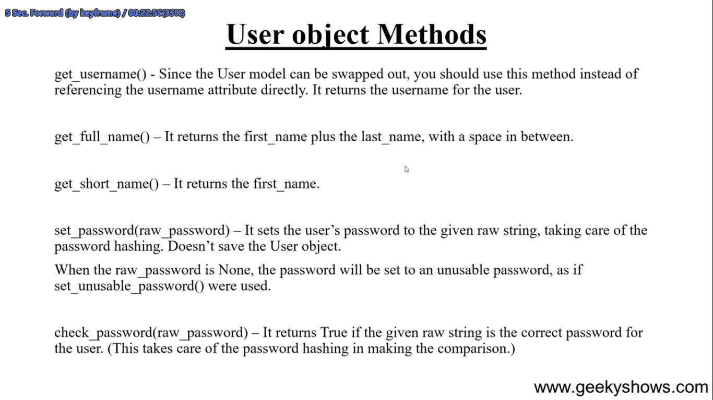
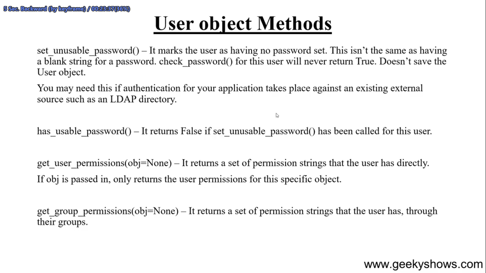
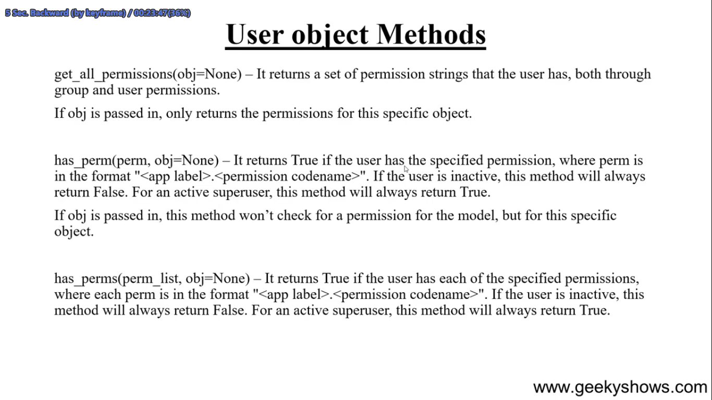
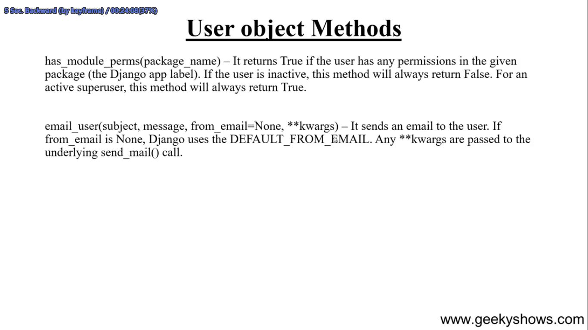
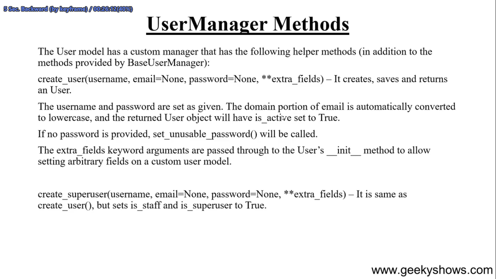
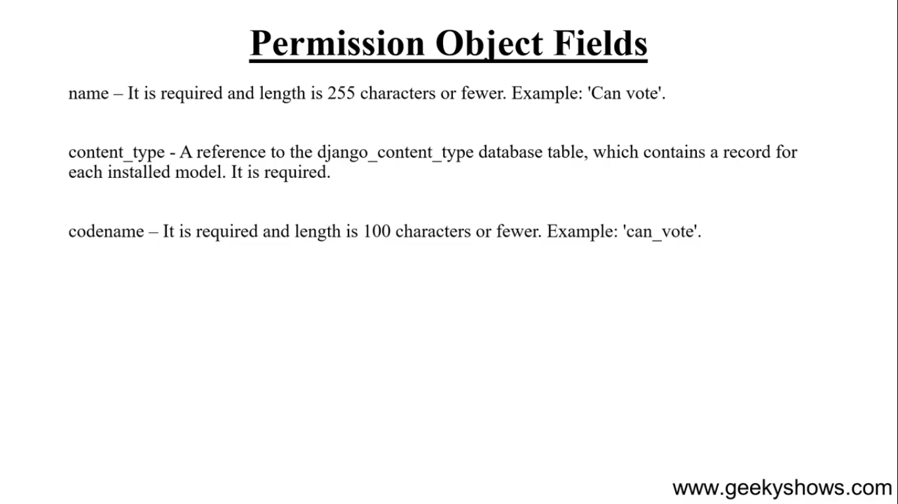

## Use Defult form

ai form age thekei kora ase sob authentication set kora ase

```python
from django.contrib.auth.forms import UserCreationForm
def singup(request):
    if request.method == 'POST':
        fm = UserCreationForm(request.POST)
        if fm.is_valid():
            fm.save()
    else:
        fm = UserCreationForm()
    return render(request, 'make_error/error.html', {'form':fm})
```

Output :



<br>
<br>

---
<br>

## Use Defult form with more fields options

aitate sob fields golo age theikei kora ase. forms a sodho user, pass silo.   
tai tar sathe abar model 'User' theke aro extra fields golou active korlam. 'UserCreationForm' form tau ai models use korse


**forms.py**

```python
from django.contrib.auth.forms import UserCreationForm
from django.contrib.auth.models import User
class SingUpFrom(UserCreationForm):
    password2 = forms.CharField(label=("Password Again"), widget=forms.PasswordInput())
    class Meta:
        model = User
        fields = ['first_name', 'last_name', 'username', 'email']
        # password fields usercreationfrom theke inherit hobe
```

Notes: aitate 'UserCreationForm' inherit kora hoise tai r password fields lekha lage nai. uporer 'password' field ta lebel change korar jonno use hoise.
Baki fields golo Models User theke asse.  
sob validation golo ager motoi thik thakbe

<br>
<br>

**views.py**

```python
from .forms import SingUpFrom
def singup(request):
    if request.method == 'POST':
        fm = SingUpFrom(request.POST)
        if fm.is_valid():
            fm.save()
    else:
        fm = SingUpFrom()
    return render(request, 'make_error/error.html', {'form':fm})
forms.py
```

Output :




<br>
<br>

---

<br>

## Default settings setup for this

```python
INSTALLED_APPS = [
    ...
    'django.contrib.auth',  # this
    'django.contrib.contenttypes',  # this
]

MIDDLEWARE = [
    ...
    'django.contrib.sessions.middleware.SessionMiddleware', # this
    'django.contrib.auth.middleware.AuthenticationMiddleware',  # this
]
```

<br>
<br>

---

<br>

## Some method











<!-- 75. Create Login Form -->