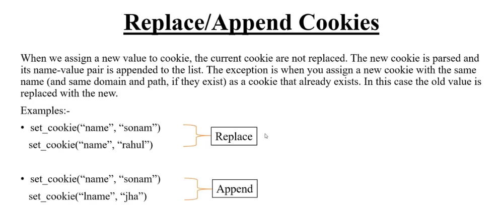
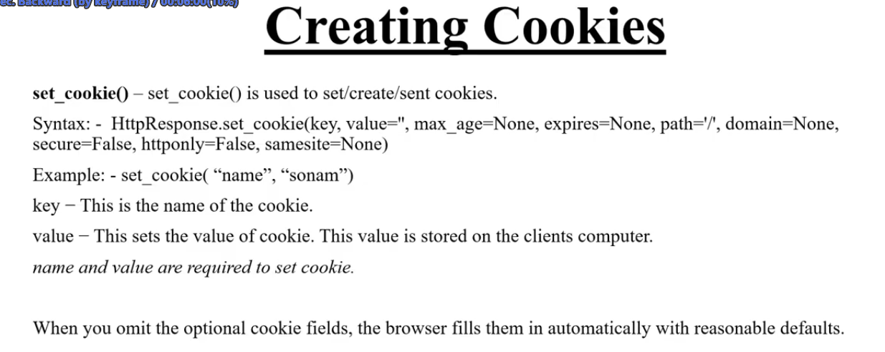
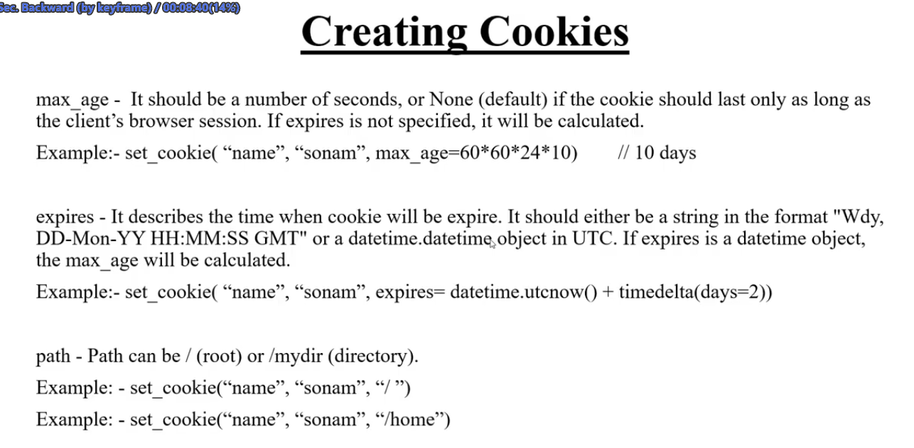
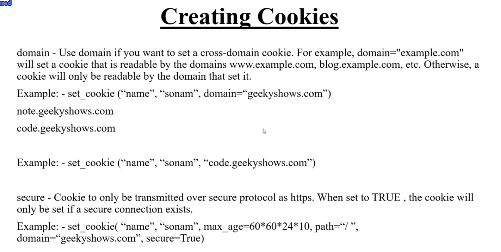
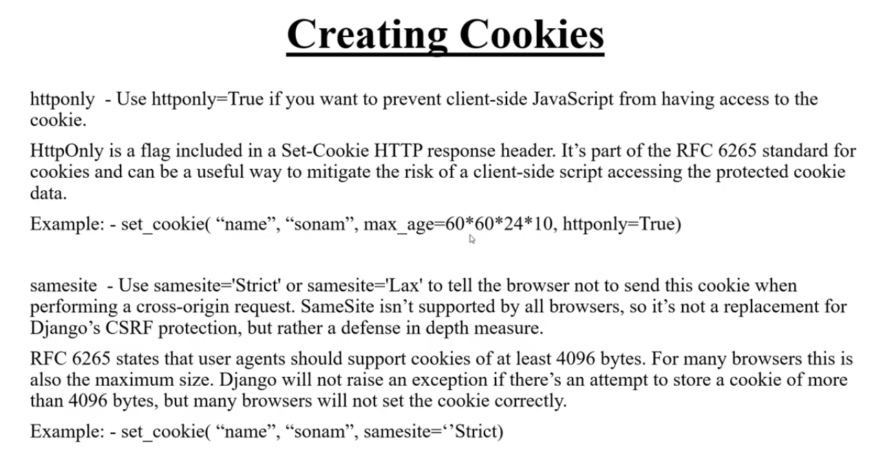
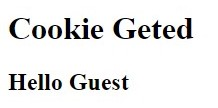
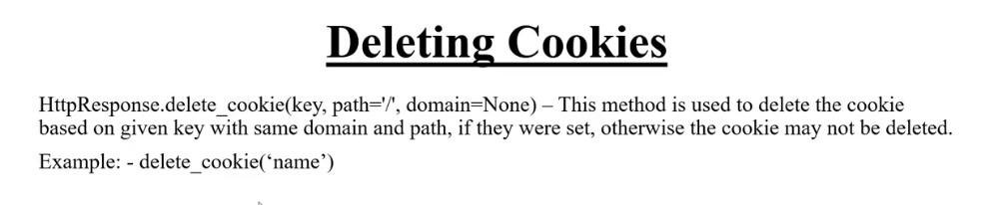

## **Cookie**

Django cookies ekta dictionary jatate 1ta key arekta value string akare thek
 

<br>
<br>

## **Set / Create**
Cookie Create korar jonno response object lage ja "return render(request, 'set_cookie.html')" aitai ekta variable er modhe rekhe cookie set kori tarpor return kore dei

```python
def setCookie(request):
    response = render(request, 'set_cookie.html')
    response.set_cookie('name', 'Md. Rakib Rayhan')
    return response
```
next a ai page lode korle cookie o set hobe

<br>

**aitar value change aivabe kore jay**
```python
...
    response.set_cookie('name', 'Rakib Rayhan')
    ...
```
  
**aitar key change korle, Append ba new cookie create hoy & agertau theke jay**
```python
...
    response.set_cookie('FName', 'Rakib Rayhan')
    ...
```

 

<br>
<br>

### **More option**

Set cookie te aro option theke ->

 

<br>

**Max_age ->** cookie koto somoy client er device a thkebe ta set kora jay. aita by defoult NONE theke mane Bowser close korle cookie o delete hoye jay

```python
...
response.set_cookie('name', 'Md. Rakib Rayhan', max_age=120) # mane 120s = 2 minit thakbe

# max_age= 60*60*24*10  -> 10days 
...
```

<br>

**Expires ->** koto din por cookie expire/delete hobe, max_age er motoi

``` python
from datetime import datetime, timedelta
...
response.set_cookie('name', 'Md. Rakib Rayhan', expires=datetime.utcnow()+timedelta(days=2)) # 2 din porjonto thakbe r baki golo python er time deyar system
...
```

 

 <br>

**Domain ->** aitate root domain set korle, sob sub domain au cookie access hobe r sub domain set korle root & others sub domain a access hobe nah

**Secure ->** aita true dile 'http' te kaj korbe nah sodho 'https' te kaj korbe

**httponly ->** Client site a javascripts access off/on korar jonno

 

 

<br>
<br>

---

<br>


## **Get / Access / Show in page**

Cookie access ba client k dekhanor jonno nicer code goli

```python
def getCookie(request):

    name = request.COOKIES['name']

    return render(request, 'get_cookie.html', {'name':name})
```

jodi cookie na pay thole error aisa pore

tai nijer code use korte hoy sob somoy

```python
    # name = request.COOKIES.get('name') # cookie na paile 'None' return korbe
    name = request.COOKIES.get('name', 'Guest') # cookie na paile 'Guest' return korbe
```

 


<br>
<br>

---

<br>
 

## **Delete**

Set korar somoy jodi 'path' othoba 'domain' set kora hoy tahole seita akhaneu mention korte hobe nahole delete hobe nah

r by defoult rakhle niser cole

```python
def delCookie(request):
    response = render(request, 'del_cookie.html')
    response.delete_cookie('name')
    return response
```

 