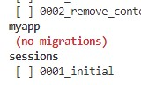
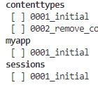
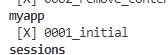
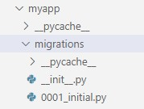
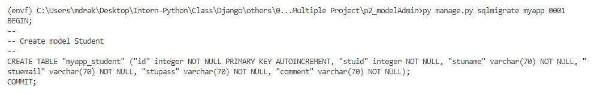
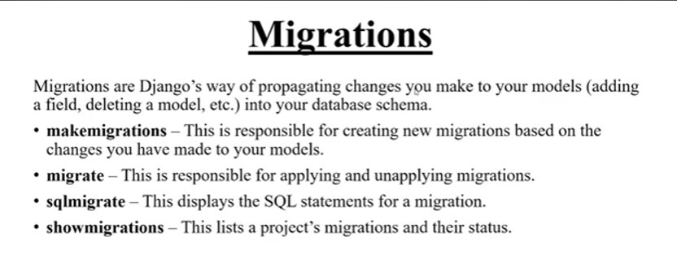

### **Basic CMD**

---

- ### showmigrate
    File golo kon obosthay ase ta dekha jay. mane file migrations kora hoise naki hoy nai aita dekha jay
    ```
    py manage.py showmigrations
    ```
    **makemigrations na kore hole**

    -   

    **migration hoye gele**

    -   

    **migrate complete hole**

    -   

- ### migrations  (*)
    model theke database table toiri korar jonno sob queary ready kore thake
    ```
    py manage.py makemigrations

    #same but aita sodho niddisto app er jonno 1st a uporer ta use korte hoy tarpor mon caile niser ta
    
    python manage.py makemigrations appname
    ```
    sathe jotobar change kore ai cmd use hobe toto bar ekti kore file create hobe, niche 0001 file create hoise, next a abar use hoile 2,3.. arokom hobe
    
- ### sqlmigrate
    upore je queary toiri hoisilo ta dekhar jonno
    ```
    py manage.py sqlmigrate myapp 0001
                        # Appname  sqlnumber
    ```
    result- appname r sqlnum image a dekha jabe
    

- ### migrate  (*)
    migrations korar por aita use hoy, sql theke database table create korar jonno. ati models.py ba app er pasa-pasi other defult ja dorkar segoloi migrate kore databse a table create kore.

    1st time admin a probes korte hobe aita obossoi korte hoy
    ```
    py manage.py migrate
    ```

    <br>
    <br>
    all in details

    


