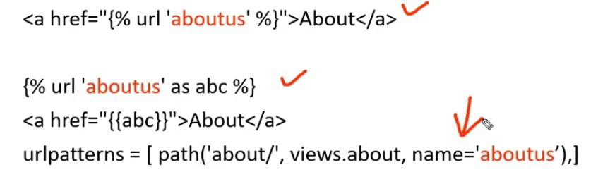

### **Load Static / CSS in HTML\_\_\_**

1. Use this in top

   ```django
   
   ```

2. Link the location

   ```html
   <link rel="stylesheet" href="" />
   <link rel="stylesheet" href="" />

   <!-- or -->

   <link rel="stylesheet" href="/static/style.css" />
   ```

   image, javascript er jonnou same

<br>

---

<br>
<br>

### **url\_\_**

```html
<a href="/about">About</a><!-- derect link -->
<!-- or - best way -->
<a href="">About</a>
<!-- or -->

<a href="{{ab}}">About</a>
<!-- urls er sathe value set kore pathanor jonno -->
<a href="">Product Details</a>
<a href="">Product Details</a>
```

more example

