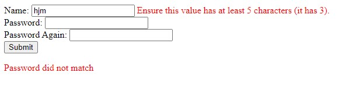

### **Error Styling**

```django
<form action="" method="POST" novalidate>
        
        <table>
            
            <div>
                {{fm.label_tag}} {{fm}} 
                <span class="errorlist">{{fm.errors|striptags}}</span>

                 
                <span class="edit">{{error}}</span>
                 

            </div>
            
        </table>
        <input type="submit" value="Submit">

         <span class="errorlist">{{form.non_field_errors|striptags}}</span> 

        
            
                <p class="edit" >{{error}}</p>
            
        
    </form>
```

Output:



Note: 
1. "{{fm.errors}}" sodho aita use korle aita 'ul,li' tag ar vitor ase. aisob default tag golo bad deyar jonno "striptags" filter use kora hoy. tar por purata ekta jekono tag a niye issa moto style korte parbo.

2. aita for loop a use kora jay tahole r "striptags" use kora lage nah. 
Tar Sathe abar "{{fm.errors}}" ai system a 2ta error asle eksathe lege jay, tader majhe ektu space toiri korar jonneu aita use hoy.

3. "{{form.non_field_errors}}" jesob error field er sathe ase nah segolo show koray. jemon multiple error ekti function ai custom vabe set korle sob error/wrong input goli kono niddisto field a na dekhiye upore ekjaygay dekhay.

<br>

---

<br>
<br>

### **Add Class From Forms.py**

```
class RegistrationForm(forms.Form):
    error_css_class = "anycss"
    required_css_class = "youwant"

    name = forms.CharField()
    ....
```

Notes: 
1. "required_css_class" from load hoyar por jesob fields "required=True" segolo sob "tr","label" te aitar class add hobe

2. "error_css_class"  error asle oi fields a "tr" a aitar class add hobe