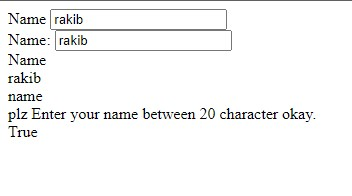
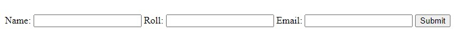
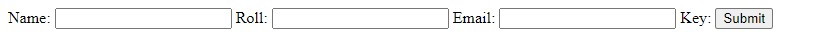
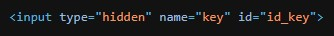

forms.py
```python
class htmlForm(forms.Form):
    name = forms.CharField(initial='rakib', help_text='plz Enter your name between 20 character okay.')
```

### **Html a Customization**
```django
<form action="">
        <div>
            <label for="{{form.name.id_for_label}}">Name</label>
            {{form.name}}
        </div>
        <div>
            {{form.name.label_tag}}
            {{form.name}}
        </div>
        <div>
            {{form.name.label}}
            <br>
            {{form.name.value}}
            <br>
            {{form.name.html_name}}  html input tag a je name atribute thake oita 
            <br>
            {{form.name.help_text}}
            <br>
            {{form.name.field.required}}  required er value dekhar jonno 
        </div>
    </form>
```

Output:



<br>

---

<br>
<br>


### **Use Loop**
```django
 <form action="" method="get">
        
        {{fm.label_tag}}
        {{fm}}
        
        <input type="submit" value="Submit">
    </form>
```

Output:



<br>

---

<br>
<br>

### **Jodi Hidden field thake**
forms.py a hidden fields
```python
class hideForm(forms.Form):
    ...
    key = forms.IntegerField(widget=forms.HiddenInput())
```

Normal form render korle thik motoi ase  
but loop use korle arokom ase



aita nicer moto likle thik hoye jabe
```django
<form action="" method="get">
        
        {{vn.label_tag}}
        {{vn}}
        

        
        {{hn}}
        
        <input type="submit" value="Submit">
    </form>
```


r code o thik motoi thakbe

