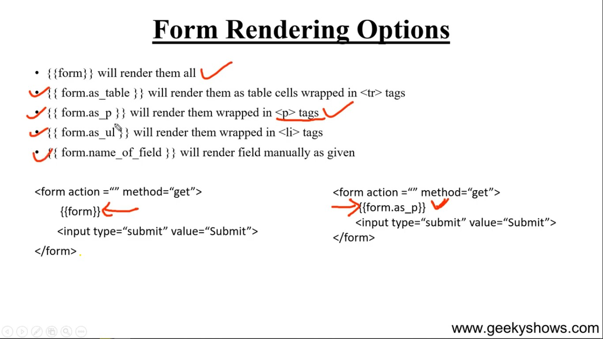
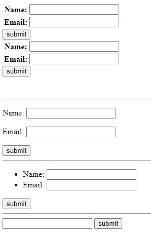

### **Rendering The Form**



```html
    <form action="" method="get">
        <table>
            {{form}}
        </table>
        <input type="submit" value="submit">
    </form>
     same 
    <form action="" method="get">
        <table>
            {{form.as_table}}
        </table>
        <input type="submit" value="submit">
    </form>

    <br>
    <br>
    <hr>

    <form action="" method="get">
        {{form.as_p}}
        <input type="submit" value="submit">
    </form>
    <hr>

    <form action="" method="get">
        <ul>
            {{form.as_ul}}
        </ul>
        <input type="submit" value="submit">
    </form>
    <hr>
    
    <form action="" method="get">
        {{form.name}}
        <input type="submit" value="submit">
    </form>
```

**Output**

as_p dile tr td thake nah    
label r input p tag er vetor thake arokomi sob golo kar kore



