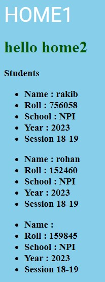

### **Template Inheritance\_\_\_**

1.  Inheritance with Extends

    0.1 base.html

    ```django
    
    
    <!DOCTYPE html>
    <html lang="en">
    <head>
        <meta charset="UTF-8" />
        <meta http-equiv="X-UA-Compatible" content="IE=edge" />
        <meta name="viewport" content="width=device-width, initial-scale=1.0" />
        <link rel="stylesheet" href="" />
        

        <title>OP</title>
    </head>
    <body>
        
    </body>
    </html>
    ```

    0.2 index.html

    ```django
    
    
    
    
    
    <link rel="stylesheet" href="" />
    <link rel="stylesheet" href="" />
    
    
    Home1
    
    
    <a href="">Home2</a>
    <h1>hello home1</h1>
    
    ```
<br>

2. Inheritance With Include

    aitate context use kora jay that's mean value pass kore as a variable hisebe kaj kora jay

    <br>

    aita views theke asa value o niye thake but seita jodi pass na korte cai se khetre 'only' use kora jay

    0.1 student.html
    ```django
    <ul>
    <li>Name : {{name}}</li>
    <li>Roll : {{roll}}</li>
    <li>School : NPI</li>
    <li>Year : 2023</li>
    <li>Session 18-19</li>
    </ul>
    ```

    0.2 view.py
    ```python
    def home2(request):
    name = 'rohan'
    return render(request, 'index.html', {'name':name})
    ```

    0.3 index.html
    ```django
    <h3>Students<h3>
    
    
    
    ```

    1.0 Output
    
    


<br>

---

<br>
<br>


### **Super block\_\_\_**

```django
    

    
    
    
    <link rel="stylesheet" href="" />
    <link rel="stylesheet" href="" />
    
    
     {{block.super}} Home
    
    

    <a href="">Home2</a>
    <h1>hello home1</h1>
    
    
```

Super block use kora hoy overwritten hoya data dekhanor jonno

output title hobe:  
**Other Home**  
<br>
output dekhe bujha gelo aita base.html a sei block er data super block er maddhome use kora jay new datar sathe

