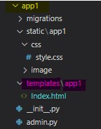
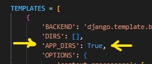

### **Setup Tamplates\_\_\_**

Jodi Tamplates folder 'App' folder er vetor banano hoy tahole settings kora lage nah aigolo default kora thake

Tamplates er por 'app1' same name a ekta folder create kora hoise  
aita jorori nah but akadhik app niye kaj korle identify korte problem hoy tai aivabe kora hoy

`R Jodi 'app' folder a na kore, 'project' folder a templates folder create kora hoy tahole settings kora lage. ja settings.md file a deya ase`
