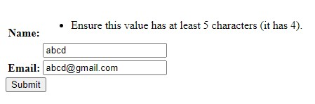
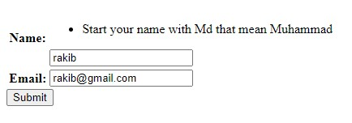

###**Set Built In Error**

```python
from django.core import validators

class Student(forms.Form):
    name = forms.CharField(validators=[validators.MinLengthValidator(5)])
    Email = forms.CharField(validators=[validators.MaxLengthValidator(20)])
    # Aro ase
```

Output:



<br>

---

<br>
<br>

###**Create own Error and set like built in**

```python
from django.core import validators

def Muslim_named(value):
    if value[0]!='m' and value[1]!='d':
        raise forms.ValidationError("Start your name with Md that mean Muhammad")

class Student(forms.Form):
    name = forms.CharField(validators=[Muslim_named])
    email = forms.EmailField()
```

Note: aitate ekta subida holo aki Error multiple fields a set kora jay

Output:

