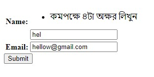
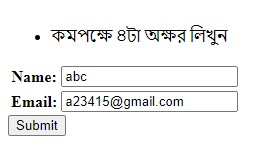
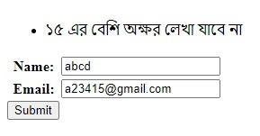

##**Single field Custom Error**

```python
class Student(forms.Form):
    name = forms.CharField()
    email = forms.EmailField()

    # def clean_fieldName(self):
    def clean_name(self):
        valName = self.cleaned_data["name"]
        if len(valName) < 4:
            raise forms.ValidationError("কমপক্ষে ৪টা  অক্ষর লিখুন")
        return valName

```

Output:




<br>

---

<br>
<br>

###**Multi field custom Error**

```python
class Student(forms.Form):
    name = forms.CharField()
    email = forms.EmailField()

    def clean(self):
        cleaned_data = super().clean()

        valName = self.cleaned_data['name']
        valEmail = self.cleaned_data['email']
        if len(valName) < 4:
            raise forms.ValidationError("কমপক্ষে ৪টা  অক্ষর লিখুন")
        if len(valEmail) > 15:
            raise forms.ValidationError("১৫ এর বেশি অক্ষর লেখা যাবে না")
```

Note: aitate 2ta mistake/wrong-input eki sathe dekhay nah 1ta 1ta kore dekhay, 1st a ekta dekhabe and tarpor oita thik korle porerta dekhabe   
and  
mistake/worng-input golo sodho frist feilds er upore dekhene (1st,2nd sob feilds er error golo aki jaygay dekhabe)

Output:





<br>

---

<br>
<br>

### **(example) match two password using - Multi error**
```python
class PasswordAgainForm(forms.Form):
    name = forms.CharField(min_length=5)
    email = forms.EmailField(required=False)
    password = forms.CharField(strip=False, widget=forms.PasswordInput())
    rpassword = forms.CharField(strip=False, label="Password Again", widget=forms.PasswordInput())

    def clean(self):

        cleaned_data = super().clean()

        if self.is_valid():
            valpass = self.cleaned_data['password']
            valrpass = self.cleaned_data['rpassword']

            if valpass != valrpass:
                raise forms.ValidationError("Password did not match")
```


