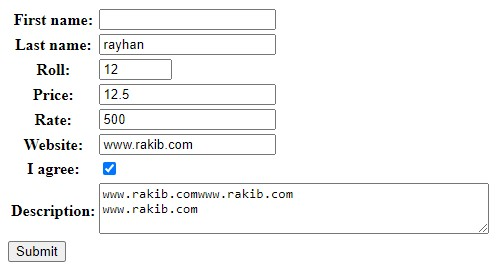
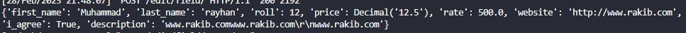

###**Types of fields and there peramitters**

```python
class Fromfieldtype(forms.Form):
    first_name = forms.CharField(min_length=5, max_length=20, strip=False, empty_value="Muhammad")
    # strip F hole -> client deya input AGE PORE space thakle ta kate nah
    # empty_value -> Kiso Input na dile by defult "Muhammad" nam nibe | ar sathe required o false hoye jay
    last_name = forms.CharField(error_messages={'required':'Enter Your Name'})
    # error_messages -> required -> kiso na dile age je Error massage asto seita change hoye ai error massage asbe
    # 'required' er jonno set kora ase onnogolor jonneu set kora jabe
    roll = forms.IntegerField(min_value=5, max_value=100) # 5 to 100
    price = forms.DecimalField(max_value=9999, max_digits=4, decimal_places=1)
    # max_digits -> 1234 or 1.246 maximum 4ta sonkha lekha jabe
    # decimal_places -> "." dot er por 1tar besi sonkha deya jabe nah 154.2
    rate = forms.FloatField(min_value=500) # forms a "." dot na dileu last a .0 nibe but decimal a ta neyna
    website = forms.URLField(max_length=100)# aitate http na dile auto niye ney output a
    i_agree = forms.BooleanField()
    description = forms.CharField(widget=forms.Textarea(attrs={'rows':3, 'cols':50}))
    # row borabor space hobe 3ta row er soman, col a hobe 50ta space mane 50tar jonno

```
**Input From Client**



**The Data/Result**




