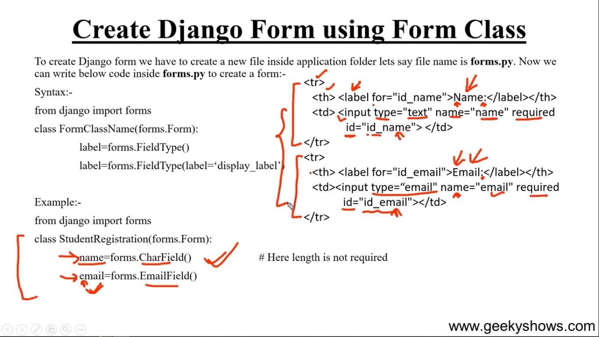
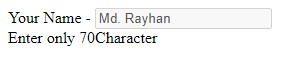

First need to create forms.py  
and -> from django import forms

- field er je nam dibe seitai html id te and 1st charecter capital hoye label a show hobe and etc pic a deya holo


**basic**
```python
from django import forms

class StudentRegistration(forms.Form):
    name = forms.CharField()
    email = forms.EmailField()
```

<br>

---

<br>
<br>

### **Customize**
```python
class cusForm(forms.Form):
    name = forms.CharField(label='Your Name', label_suffix=' - ', initial='Md. Rayhan', required=False, disabled=True, help_text='Enter only 70Character' )
```
explain:

1. label used for change label value - age silo 'name' akhon 'your name'

2. label_suffix used for remove ":" from lavel

3. initial used for define value in input box [aita pore client change korte parbe] 

4. requitred age theke thake but 'False' diye aita fillup na korleu form submit hobe

5.disabled true dile input value change kora jay nah ba client kono value dite parbe nah

6. help_text just a text user k bujhanor jonno kemne ki korte hobe



