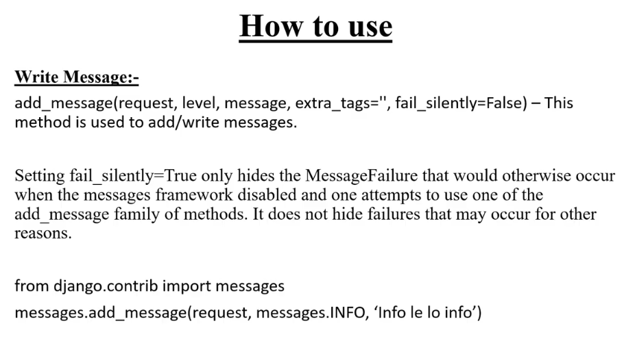
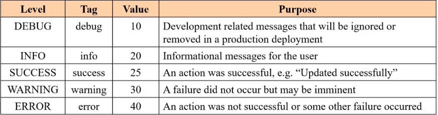
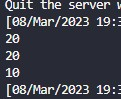
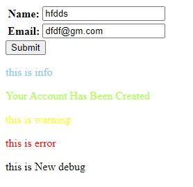

## **What is Messages Framework**

Kono Niddisto Condition true hoyar por client ke kono messages dite caile er maddhome deya jay  
jemon from submition er por success, wrong etc message

<br>

---

<br>
<br>

## **Requarments ->settings.py**

niser ai 3 ta jaygay aisob jinis golo thakte hobe aita thik moto run korar jonno

aigolo default vabe age thekei thake

```
INSTALLED_APPS = [
    'django.contrib.messages', # aita
    ...
]

MIDDLEWARE = [
    'django.contrib.sessions.middleware.SessionMiddleware', # aita
    'django.contrib.messages.middleware.MessageMiddleware', # aita
    ...
]

TEMPLATES = [
    {
        ...
        'OPTIONS': {
            'context_processors': [
                ...
                'django.contrib.messages.context_processors.messages', # aita
            ],
        },
    },
]
```


<br>

---

<br>
<br>


## **Messages ready kora -> Views.py**

aitar default syntext




```python
from django.contrib import messages

def Sud(request):
    if request.method == 'POST':
        fm = build_in(request.POST)
        if fm.is_valid():
            ...
            ...
            myuser.save()

            messages.add_message(request, messages.SUCCESS, 'Your Account Has Been Created')
            # same
            messages.success(request, 'Your Account Has Been Created')

    else:
        fm = build_in()
    return render(request, 'make_error/save_u_d.html', {'form':fm})
```

Notes: 
1. Aitar jonno Context ba value html(return) er jonnno dictionary te dite hoy nah aita auto cole jay
2. upore 2ta system dekhano hoise. 2num ta holo shortcut aita sobai use kore

<br>
<br>

## **Aro ja use kora jay**

```python
def Sud(request):
    fm = build_in() # aita alada, aita form.py theke form

    messages.info(request, 'this is info')

    print(messages.get_level(request))

    messages.success(request, 'Your Account Has Been Created')
    messages.warning(request, 'this is warning')
    messages.error(request, 'this is error')

    messages.debug(request, 'this is debug')
    print(messages.get_level(request)) # Not work

    messages.set_level(request, messages.DEBUG)
    messages.debug(request, 'this is New debug')
    print(messages.get_level(request))

    return render(request, 'make_error/save_u_d.html', {'form':fm})
```

Notes : 

0. Uporer sob golor ekta value ase

   

1. 20 er nise mane 'info' aita & aitar niser sob golo use korte parbo

2. 'debug' aita normaly arokom vabe use kora jay nah, aita use korar jonno set level mane "messages.set_level(request, messages.DEBUG)" korte hoy & aitar pore 'debug' message dile kaj korbe

3. aigolo value dekhar jonno ba aita niye kaj korar jonno "get_level" use kora hoy
   
   


<br>

---

<br>
<br>


## **Html a Show Kora**

```django
<body>
    ...
    </form>

    
        

        <p  class="{{message.tags}}" >

            {{message}}

        </p>

        
    
</body>
```

Notes:

1. 'messages' variable a message ase   (multiple message thakte pare tai for a deya)

2. 'message.tag' aitate 'message level'/kon dhoroner masage ta set hoy aita css er jonno use kora jay

   ```css
        .success{
            color: greenyellow;
        }
        .info{
            color: skyblue;
        }
        .warning{
            color: yellow;
        }
        .error{
            color: red;
        }
   ```

<br>

---

<br>
<br>

## **Tag name change kora CSS er jonno**

User kono vul input dile seita red color ba Danger class use hoy Bootstrap a. tai nijer moto class dite hole niser system follow korte hobe

**Settings.py**

```python
from django.contrib.messages import constants as messages_retag

MESSAGE_TAGS = {messages_retag.ERROR:'danger'}
# default    =     constants .level : rename
```

Notes:

1. 'constants' import kore ai kaj kora jay upore 'constants' ke as dile 'messages_retag' ai nam a use kora hoise

Next a
```css
.danger{
    color: red;
}
```


Output:



