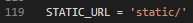

### **Setup Static\_\_\_**

Jodi Static folder App folder er vetor banano hoy tahole settings kora lage nah aigolo default kora thake

static er por app1 same name a ekta folder create kora hoise  
aita jorori nah but akadhik app niye kaj korle identify korte problem hoy tai aivabe kora hoy

`R Jodi app folder a na kore, project folder a static folder create kora hoy tahole settings kora lage. ja settings.md file a deya ase`
