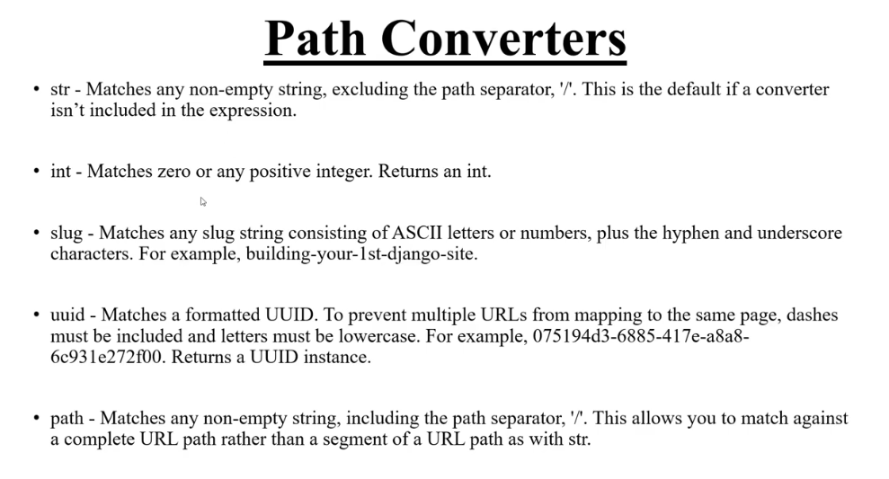

### **Path Converters**


### dymanic urls

```python
urlpatterns = [
    path('', views.home, name='home'),
    path('product/', views.productDetails, name='details'),
    path('product/<my_id>/', views.productDetails, name='details'), # <str:my_id> same
]
```

views.py

```python
def productDetails(request, my_id='555'):
    return render(request, 'dynamicurl/details.html', {'num': my_id})
```

Notes:
1. str/int/slug etc kisoi define na korle aita defult vabe 'str' hisebe kaj kore.  

2. 'my_id' aita views a peramitter hisebe nibe and etc logical kaj korte parbe

3. views.py a "my_id='555'" aita alada vabe define korle aitar mane hobe, jodi 'subvalue/my_id' theke kono value na ase tahole defalut vabe 555 set korbe

<br>
<br>

### dubble subvalue

```python
    path('product/<my_id>/<int:intvalue>/', views.productDetails2, name='details2'),
```

Notes: 
1. mone kori 'my_id' r 'intvalue' doitatei 1 value ase
2. tahole view fuction a str(my_id) er jonno '1' r int er jonno 1
aivabe value pabe

niser niyome seta niye kaj kora jay
```python
if intvalue == 1 and my_id == '1':
```


<br>
<br>
<br>

### Kwargs value set kora__

```python
    path('products/', views.product, {'pt': 'best product'}, name='product'),
```
aivabe likhe views.py function a amra key "pt" peramitter hisebe niye pore kaj korte pari,  
exam -> def product(request, pt):


<br>
<br>
<br>

## Img soho Sokol path converters er details 



