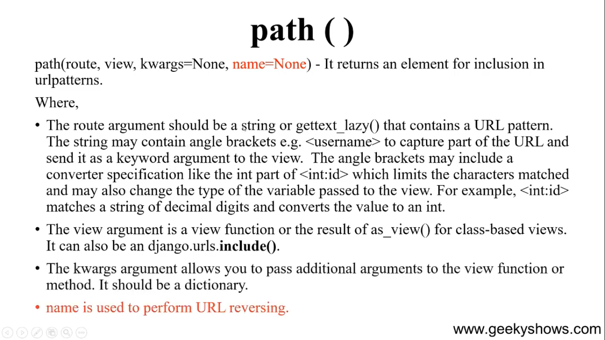

### **Basic\_\_\_**

```python
from django.urls import path
from . import views

urlpatterns = [
    path('', views.Home1View.as_view(), name='home1'), # for class-based view
    path('home2/', views.home2, name='home2'), # for function-based view
]
```

### **Ati jaja support kore**



Kwargs aita just  dictionary maddhome value pathanor poddhoti ja dynamic-urls.md te deya hoyece