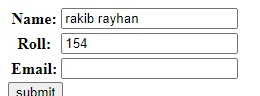

Forms.py theke form banale defalte vabe colon thake


<br>

### **: Remove korar jonno___**
use label_suffix=' '
```python
def home(request):

    fm = myForm(label_suffix=' ')
    # fm = myForm(auto_id=False, label_suffix=' ')
    return render(request, 'app_F_Edit/index.html', {'form':fm})
```
output


sathe onno value o deya jay --> label_suffix='-'


<br>

---

<br>
<br>

### **Input box a age theke value deyar jonno**
Note: client cailei ai value change korte parbe
```python
fm = myForm(initial={'name':'rakib rayhan', 'roll': '154'})
```
1. aita dictonary akare value ney  
2. key golo forms.py er variable theke set korte hoy
3. sob golote na dile plm nai
4. value pore web theke change kora jay
5. aita form.py au set kora jay r seitate dictonary akare deya lage nah

Output 



