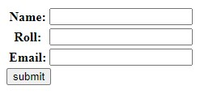
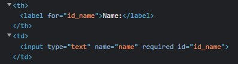
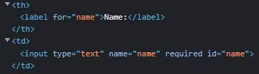
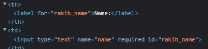
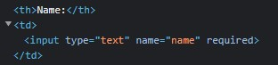

### **Normally Jevabe ase**




### **Html Id Change korar jonno___**

Myform object er vitor '**auto_id**' dite ai customize kora hoy

### **True**
```python
def home(request):

    fm = myForm(auto_id=True)

    return render(request, 'app_F_Edit/index.html', {'form':fm})
```
Output:

je name diye forms.py a variable kora hoise oitai thakbe 'id', 'for' a..



<br>

### **String**
```python
fm = myForm(auto_id='rakib')
```
ai jaygay sodho sting dile seta True hisebe nibe output o same

<br>

### **String with _%s**
```python
fm = myForm(auto_id='rakib_%s')
```
Output:

sting er pr _%s dile output asbe rakib_variableName



<br>

### **False**
```python
fm = myForm(auto_id=False)
```
Output:

False dile 'id', 'level soho for' delete hoye jabe



