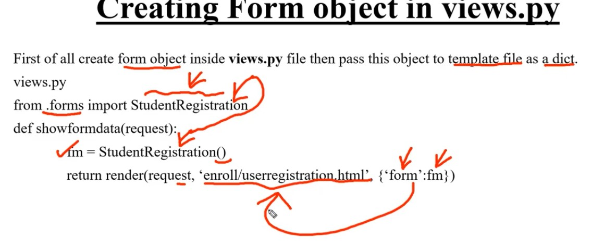

form ta import kore object create kore ekta variable a rakhte hobe next a html a sent korte hobe




**Basic**
```python
from .forms import StudentRegistration

def home(request):
    fm = StudentRegistration() # create a object
    return render(request, 'app_formApi/index.html', {'form':fm})
```

