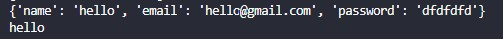

###**Form Validation___**

```python
# validForm import kora hoise forms.py theke
def valid(request):
    if request.method == 'POST':
        fm = validForm(request.POST)
        if fm.is_valid():
            data = fm.cleaned_data
            name = fm.cleaned_data['name']
            print(data)
            print(name)
    else:
        fm = validForm()
    
    return render(request, 'app_F_Edit/validating.html', {'form': fm})
```

Output:



note:
1. validForm(request.POST) aita client input value nibe, ja normally html form code er sathei niye thake.

2. cleaned_data form theke just value niye thake, aita dictonary akare kaj kore, tai je KEY dibe seita output dibe. r form validation er por je value ase take cleaned_data bole. r aita is_valid er por sodho use kora jay

3. django te default validation thake jodi user vul input dey tahole take seita show kore.
akhon jodi fm.is_valid() na use kora hoy tahole normally client/user k vul dekhaleu, output/database a ai data golo amnei vul golou store korbe

4. name1 = request.POST['name'] aitau use kora jay but aita validation er khetre use na kora valo, django oitai sujject kore karon oita sodho validation er por use korar jonno design kora(cleaned_data)

5. Validation r input sob thik thak hoye gele blank form hisebe aita 'fm = validForm()' use na kora, aitate vul/ dubble submittion o hoyar chance thake, tai just redirect ba onno html link kora like congratulation.html type use kora

6. "if fm.is_valid():" false hole aita auto matic last a return a client je vhul korse seita pass kore. Tai "if fm.is_valid():" True er vitor "Return" thakleu baire arekta dite hoy --It's very importent
