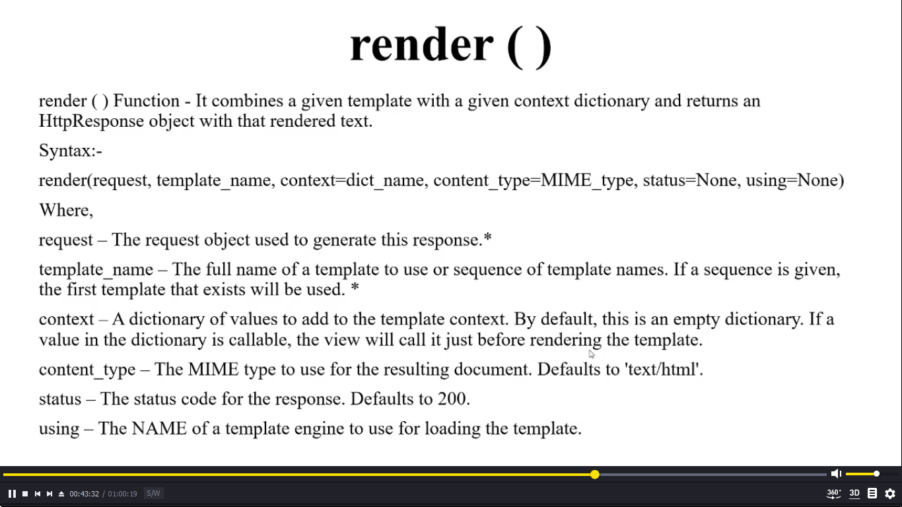

### **Basic\_\_\_**
Note : Class-based view a amra CamolCase use kori r last a View mention kori jate sohoje find kora jay urls,etc jaygay but it's not necessary unless better habit

```python
from django.shortcuts import render
from django.views import View # for class-based view

class Home1View(View):
    def get(self, request): # Normal sob request golo 'GET' a ase
        return render(request, 'app1/index.html')

def home2(request):
    return render(request, 'index.html')
```

render function html template render kore atia je je peramitter use kore ta holo :  
render(request, template_name, context=dict_name, content_type=MIME_type, status=None, using=None)   
Details below :



<br>
<br>

or for only text or little bit html

```python
from django.http import HttpResponse

def HtmlorText(request):
    return HttpResponse("<h1 style='text-align: center;'> hello Rakib </h1>")
```
<br>

---

<br>
<br>

### **Function peramitter**

def hello(reqeust, *args, **kwargs)

```python
def hello(request) # aita defalt django theke koquest grohonr use hoy
```
```python
def hello(*args) #akadhik peramitter recive kore r tuples akare return kore aigolo normal python au use hoy
#example
def hello(name, roll)
# upore 2ta same

hello('rakib, 1542)

```
```python
def hello(**kwargs) # aitau aki but aita key r value recive kore diction moto r dictionary return kore   aita urls er sathe use kora jay
```

0. example:

    url.py

    ```python
    path('keywordArguments/<str:name1>/<str:name2>/', views.hello, name='kewagrs')
    ```

    view.py
    ```python
    def hello(request, **kwargs):
    name1 = kwargs.get('name1')
    name2 = kwargs.get('name2')
    return render(request, 'app1/kewargs.html', {'name1': name1, 'name2':name2})
    ```


```python
def hello(**args)# aitau kwargs er motoi kaj korbe
```
