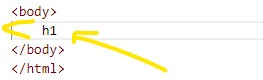
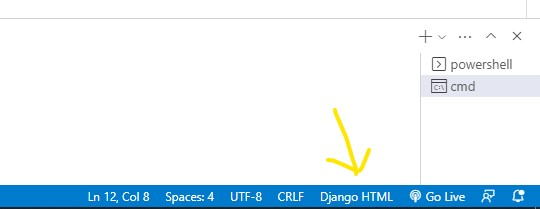
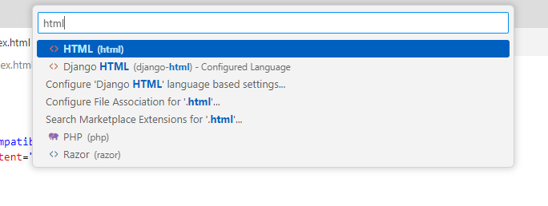
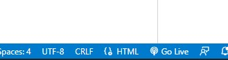
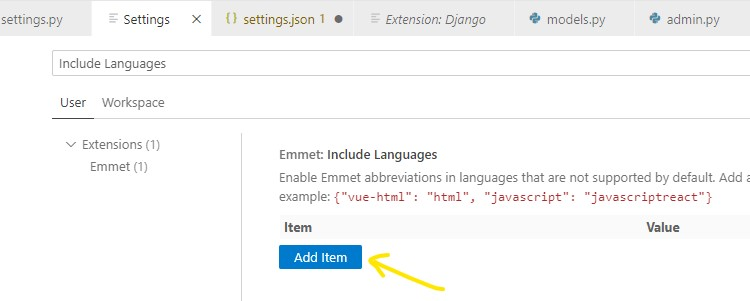
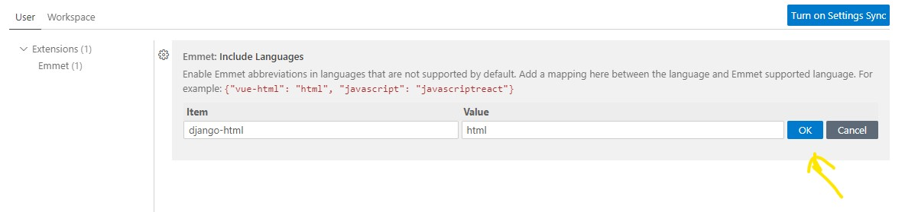

### **The Problem___**
Not auto completing the Html tag

## Temporary solution
---

 
 
 
**then**
 
 

 

**then you see this**
 

And the problem will be solve but if you need to work with django tag to auto complete change it again to **django-html**
 
 

## Permanenet solution
---
**Let's see what they saying**

Now Go to **preferenses** and then **setting** and find this by searching Include Languages

 
 
 
and add this one

The Problem will be permanently solve and also django autocomplete is okay. next time if you need to work again you don't find this isso

